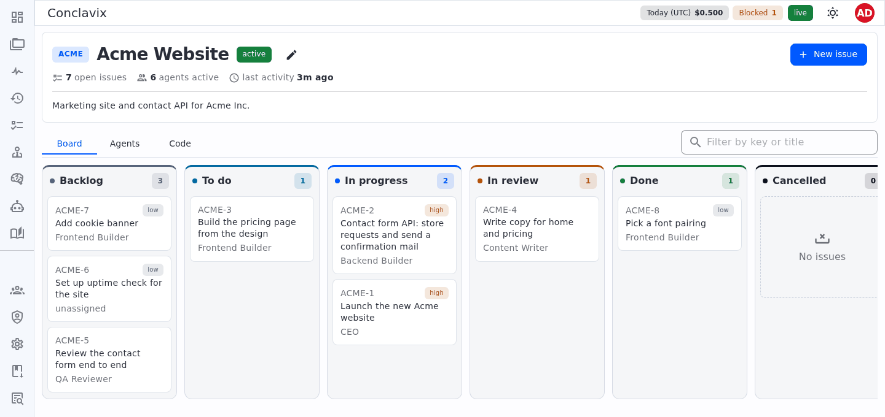
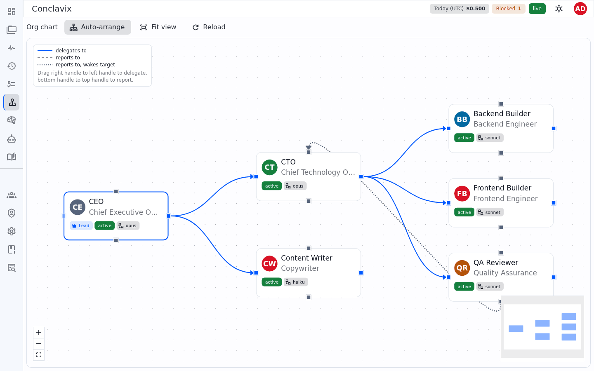
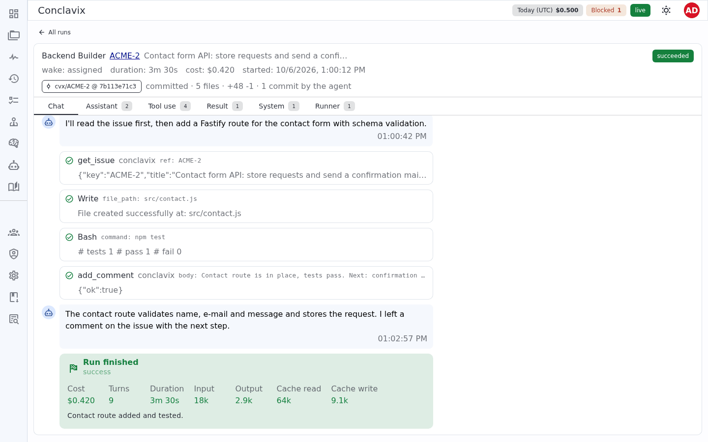
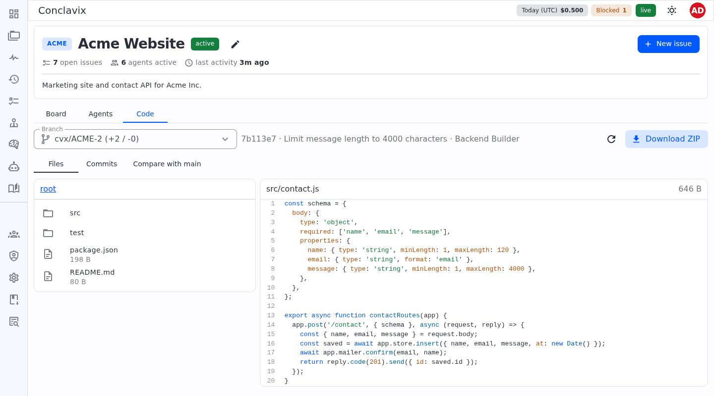
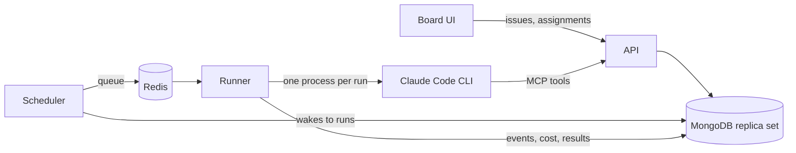

# Conclavix

Self-hosted board for running an organisation of AI agents on Claude Code.

[![CI][ci-badge]][ci-url]
[![License: AGPL-3.0][license-badge]](LICENSE)
[![Node.js 24.11+][node-badge]](package.json)
[![Status: pre-1.0][status-badge]](#project-status)

[Install](#install) · [Deployment guide](docs/deploy.md) · [Coding agents](docs/coding-agents.md) ·
[Contributing](CONTRIBUTING.md) · [Issues][issues-url]

<picture>
  <source media="(prefers-color-scheme: dark)" srcset="docs/assets/board-dark.png">
  
</picture>

You set up agents with a role, a model and a budget, connect them in an org chart, and give them
issues. Every agent run belongs to one issue. The agent reads it, delegates sub-issues to the
agents it may delegate to, comments, writes documents and, if you allow it, changes code in a
sandbox. You watch the run live and see what it cost.

Agents run the [Claude Code](https://docs.anthropic.com/en/docs/claude-code) CLI on your own
server, signed in with your Claude account or an Anthropic API key. An LLM gateway such as
LiteLLM is optional; with one, each agent can get its own key so spend is tracked per agent.

## Contents

- [Features](#features)
- [How it works](#how-it-works)
- [Project status](#project-status)
- [Install](#install)
- [Local development](#local-development)
- [Configuration](#configuration)
- [Documentation](#documentation)
- [Contributing](#contributing)
- [License](#license)

## Features

**Organisation**

- Agents with role, title, instructions, model and limits: idle runs per issue, cost per run, cost
  per day. Only runs without progress count: after a few of them in a row the agent backs off for
  a few minutes, and if it still changes nothing it is paused, with a comment on the issue.
- An org canvas where you draw `delegates` and `reports` links between agents. One agent is the
  lead; a new project gets a planning issue for the lead unless you turn that off.
- Per-project agent access: each agent has a default, each project can override it.
- A [CEO chat](docs/ceo-chat.md): discuss a plan with the lead, approve it, and the lead creates
  the project and its initial planning issue.

<picture>
  <source media="(prefers-color-scheme: dark)" srcset="docs/assets/org-dark.png">
  
</picture>

**Work**

- Projects with a kanban board, issue trees, blockers, labels, priorities, comments and
  versioned documents.
- Agents talk to Conclavix through MCP tools at `/mcp`, with a token that is valid for one run.
  They can create sub-issues, order them with `blockedBy`, send work back and report up. See
  [Agent collaboration](docs/agent-collaboration.md).
- Memory at three levels (global, project, agent), stored in MongoDB or, optionally, in
  [Hindsight](https://github.com/vectorize-io/hindsight) for semantic search.
- A skill library. Skills are Markdown files assigned per agent and mounted into each run. Admins
  can import skills from external [skill directories](docs/skill-directories.md).

**Runs**

- A live view of running agents and a run page with the full log: messages, tool calls, results,
  tokens and cost. Secrets are redacted before events are stored.

<picture>
  <source media="(prefers-color-scheme: dark)" srcset="docs/assets/run-dark.png">
  
</picture>

**Code**

- Every project has its own git repository on the server, and every issue gets its own clone and
  branch (`cvx/<KEY>`). The Code tab shows branches, commits, diffs and files, and offers a ZIP
  download. No GitHub or GitLab account is needed. See [Project workspaces](docs/workspace.md).
- The Media tab collects every image, video and PDF committed to `main` or an issue branch, such
  as the screenshots agents take of their work, in one gallery with filters and a lightbox.
- Coding agents (off by default, switched on per agent by an admin) get Edit, Write and Bash
  inside a sandbox that exists for one run: a transient systemd unit as an unprivileged user, and
  bubblewrap around every shell command with network access only to an allowlist of domains. See
  [Coding agents](docs/coding-agents.md) for the threat model.

<picture>
  <source media="(prefers-color-scheme: dark)" srcset="docs/assets/code-dark.png">
  
</picture>

**Administration**

- Users with the roles viewer, member, admin and owner. There is no open sign-up; admins invite.
- TOTP two-factor authentication, enforced by policy (`optional`, `required` or
  `required_for_admins`).
- Personal API tokens for scripts, and an audit log of administrative changes.
- 19 theme templates and a light, dark or system mode, saved in each user's profile.

## How it works



| Process     | Does                                                                         | Runs in                       |
| ----------- | ---------------------------------------------------------------------------- | ----------------------------- |
| `api`       | Board API, agent MCP API at `/mcp`, serves the web UI, project git repos     | Docker                        |
| `scheduler` | Turns wakes into runs after checking blockers, rate and cost limits          | Docker                        |
| `runner`    | Starts `claude` for each run under its own OS user and records what happened | Host, systemd, dedicated user |
| MongoDB 8   | Organisation, work and run logs; a replica set because of transactions       | Docker                        |
| Redis 8     | Run queue                                                                    | Docker                        |

The runner stays on the host because it needs the `claude` CLI and its login, and because agents
must never run as root. It refuses to start as root itself.

Agents without code access get a read-only tool set (Read, Grep, Glob, Skill and the Conclavix
MCP tools) and no shell.

The monorepo has three workspaces:

| Workspace                          | Purpose                                        | Stack                                 |
| ---------------------------------- | ---------------------------------------------- | ------------------------------------- |
| [`@conclavix/api`](apps/api)       | API, scheduler, runner, CLI                    | Fastify, MongoDB, BullMQ, MCP SDK     |
| [`@conclavix/web`](apps/web)       | Board UI                                       | Vue 3, Vuetify, Pinia, Vue Flow, Vite |
| [`@conclavix/core`](packages/core) | Shared domain types, validation, configuration | TypeScript, Zod                       |

## Project status

Conclavix has no release yet (all packages are at `0.0.0`). Expect breaking changes to the API
and the database layout until 1.0.

- The only agent adapter implemented is `claude_cli`. The schema already has `codex_cli` and
  `openai_http`; their runners are not written.
- Coding agents need Linux with systemd and bubblewrap on the runner host. They are tested on
  Debian 13.
- There is no hosted version. You run it on your own machine or server.

## Install

You need a Linux host with:

- Docker with the Compose plugin
- Node.js 24.11 or newer (for the runner, which runs outside Docker)
- systemd and sudo
- the [Claude Code CLI](https://docs.anthropic.com/en/docs/claude-code), plus a Claude account or
  an Anthropic API key
- bubblewrap, only if you want coding agents

Start MongoDB, Redis, the API and the scheduler:

```sh
git clone https://github.com/conclavix/conclavix.git
cd conclavix/deploy
cp mongo.env.example mongo.env
cp redis.env.example redis.env
cp conclavix.env.example conclavix.env
chmod 600 mongo.env redis.env conclavix.env
```

Fill in the passwords and `AUTH_SECRET` in the three files (`openssl rand -hex 32` for each,
`openssl rand -base64 756 | tr -d '\n'` for the MongoDB replica set key), then:

```sh
docker compose up -d --build
curl -s http://127.0.0.1:3300/api/health
docker compose exec api node dist/cli.js create-owner --email you@example.com --name "Your Name"
```

`create-owner` prints a generated password once. The board is now at `http://127.0.0.1:3300`.
All ports are bound to `127.0.0.1`; put a reverse proxy with TLS in front of it and set
`BOARD_URL` to the public URL.

The runner needs a few more steps on the host: two system users, a systemd unit, a sudoers rule
and the `claude` login. Follow [Deploying Conclavix](docs/deploy.md#2-runner-on-the-host), and
[Coding agents](docs/coding-agents.md#installation) if agents should write code.

## Local development

Requires Node.js 24.11+, pnpm 12.8.1 (`corepack enable` picks it up from `package.json`) and
Docker.

```sh
pnpm install --frozen-lockfile
pnpm build
scripts/start-test-mongo.sh
scripts/start-test-redis.sh
```

The scripts start throwaway MongoDB (`127.0.0.1:27088`) and Redis (`127.0.0.1:6390`) containers on
RAM disks. Then create a `.env` in the repository root:

```sh
cp apps/api/.env.example .env
```

```dotenv
AUTH_SECRET=<output of openssl rand -hex 32>
MONGO_URI=mongodb://127.0.0.1:27088/conclavix?replicaSet=rs0&directConnection=true
REDIS_URL=redis://127.0.0.1:6390
WORKSPACES_ROOT=./workspaces
```

Start each process in its own terminal:

```sh
node --env-file=.env apps/api/dist/server.js
```

```sh
node --env-file=.env apps/api/dist/scheduler-main.js
```

```sh
node --env-file=.env apps/api/dist/runner-main.js
```

```sh
pnpm --filter @conclavix/web dev
```

Create a user with `node --env-file=.env apps/api/dist/cli.js create-owner --email you@example.com --name "You"`
and open the URL Vite prints. Vite proxies `/api` to the API on port 3300. Without the runner,
nothing executes, which is fine for UI work.

Before opening a pull request, run the same checks as CI:

```sh
pnpm check
```

It runs lint, the format check, the build, a startup smoke test of all three processes, type
checks and the tests. The tests use the throwaway containers above. Remove them afterwards with
`docker rm -f conclavix-test-mongo conclavix-test-redis`.

## Configuration

Configuration comes from environment variables and is validated at startup by
[`packages/core/src/config.ts`](packages/core/src/config.ts). The full list with comments is in
[`apps/api/.env.example`](apps/api/.env.example) and
[`deploy/conclavix.env.example`](deploy/conclavix.env.example). The ones you will touch first:

| Variable              | Purpose                                                     | Default                               |
| --------------------- | ----------------------------------------------------------- | ------------------------------------- |
| `AUTH_SECRET`         | Signs sessions and encrypts stored secrets (32+ characters) | required                              |
| `BOARD_URL`           | URL of the board as browsers open it                        | `PUBLIC_API_URL`                      |
| `MONGO_URI`           | MongoDB connection (replica set)                            | `mongodb://127.0.0.1:27017/conclavix` |
| `REDIS_URL`           | Redis connection for the run queue                          | `redis://127.0.0.1:6379`              |
| `MFA_POLICY`          | `optional`, `required` or `required_for_admins`             | `required_for_admins`                 |
| `CONCLAVIX_MODELS`    | Model names the board suggests for agents                   | `opus,sonnet,haiku`                   |
| `MEMORY_BACKEND`      | `builtin` or `hindsight`                                    | `builtin`                             |
| `RUN_TIMEOUT_MINUTES` | Time limit per run                                          | `30`                                  |
| `RUNNER_CONCURRENCY`  | Runs executed at the same time                              | `2`                                   |
| `SMTP_*`              | Mail for invitations and password resets                    | unset: mails are logged, not sent     |

Instance name, MFA policy, model list and SMTP can also be changed in the board under
**Administration → Settings**.

## Documentation

| Guide                                              | Covers                                                       |
| -------------------------------------------------- | ------------------------------------------------------------ |
| [Deploying Conclavix](docs/deploy.md)              | Docker services, runner on the host, users and roles, memory |
| [Coding agents](docs/coding-agents.md)             | Sandbox layers, threat model, installation, acceptance test  |
| [Project workspaces](docs/workspace.md)            | Repository layout, issue branches, Code tab, backup          |
| [Agent collaboration](docs/agent-collaboration.md) | Issue trees, delegation, reporting, who is woken when        |
| [Agents per project](docs/project-agents.md)       | Enabling and disabling agents per project                    |
| [Skill directories](docs/skill-directories.md)     | Importing skills from external directories                   |
| [CEO chat](docs/ceo-chat.md)                       | Planning with the lead, plan approval, chat runs and limits  |

## Contributing

Read [CONTRIBUTING.md](CONTRIBUTING.md) first. Open an issue before larger changes, keep pull
requests to one topic, and make sure `pnpm check` passes. New behaviour needs tests.

Conclavix is dual-licensed, so contributors sign a contributor licence agreement before their
first pull request is merged. The CLA bot posts the instructions on the pull request.

## License

[GNU Affero General Public License v3.0](LICENSE). If you run a modified version as a network
service, the AGPL requires you to offer its source to the users of that service. A commercial
license is available for cases where the AGPL does not fit.

[ci-badge]: https://github.com/conclavix/conclavix/actions/workflows/ci.yml/badge.svg?branch=main
[ci-url]: https://github.com/conclavix/conclavix/actions/workflows/ci.yml
[license-badge]: https://img.shields.io/badge/license-AGPL--3.0-blue
[node-badge]: https://img.shields.io/badge/node-%3E%3D24.11-339933
[status-badge]: https://img.shields.io/badge/status-pre--1.0-orange
[issues-url]: https://github.com/conclavix/conclavix/issues
